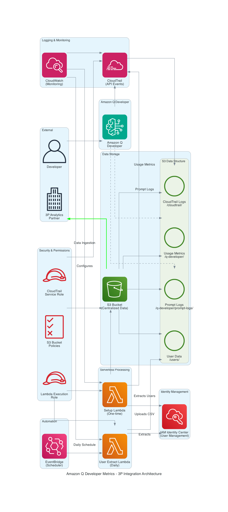

# Amazon Q Developer Metrics - 3P Integration

This repository contains tools for integrating Amazon Q Developer with 3P analytics platforms.

## Architecture Overview



The architecture diagram above illustrates the complete data flow and component relationships in the Amazon Q Developer 3P Integration solution:

- **Amazon Q Developer** generates usage metrics and prompt logs
- **CloudTrail** captures API events for comprehensive auditing
- **S3 Bucket** serves as the centralized data repository with organized structure
- **Lambda Functions** handle setup and daily user data extraction
- **IAM Identity Center** provides user management and data export
- **EventBridge** schedules automated daily processes
- **3P Analytics Partner** ingests data from the S3 bucket for analysis

## Components

### 1. One-time Setup - Python Script (`setup_q_developer_3p_metrcis.py`)

A Python script that automates the setup process for Amazon Q Developer data ingestion to 3P Partner:
- Creates an S3 bucket with required permissions for both Amazon Q and CloudTrail
- Sets up CloudTrail with necessary configuration
- Provides instructions for manual Amazon Q Developer configuration
- Exports users from AWS IAM Identity Center

### 2. One-time Setup - Lambda Function (`q_developer_3p_metrics_setup_lambda.py`)

A serverless AWS Lambda function that performs the same setup process, suitable for automated or scheduled execution:
- Creates an S3 bucket with required permissions
- Sets up CloudTrail with necessary configuration
- Exports users from AWS IAM Identity Center (optional)

### 3. Daily Scheduled Job - IAM Identity Center User Extraction Lambda (`iam_identity_center_user_extract_lambda.py`)

A dedicated serverless AWS Lambda function that focuses solely on extracting users from IAM Identity Center:
- Connects to IAM Identity Center
- Extracts user information
- Saves it to a CSV file
- Uploads the CSV file to the specified S3 bucket

## Prerequisites

- AWS CLI configured with appropriate permissions
- Python 3.6+
- AWS account with access to Amazon Q Developer, CloudTrail, and IAM Identity Center
- Appropriate IAM permissions for the user/role running these scripts

## Setup Instructions

### Python Environment Setup

Before running the scripts, set up a Python virtual environment:

1. **Create and activate a virtual environment**:

   ```bash
   # Create a virtual environment named 'venv'
   python -m venv venv
   
   # Activate the virtual environment
   # On macOS/Linux:
   source venv/bin/activate
   # On Windows:
   # venv\Scripts\activate
   ```

2. **Install required dependencies**:

   ```bash
   # Install dependencies from requirements.txt
   pip install -r requirements.txt
   ```

3. **Verify installation**:

   ```bash
   # Verify boto3 is installed correctly
   python -c "import boto3; print(boto3.__version__)"
   ```

### Option 1: Python Script Setup

#### Usage

1. **Activate your virtual environment**:
   ```bash
   # On macOS/Linux:
   source venv/bin/activate
   # On Windows:
   # venv\Scripts\activate
   ```

2. **Run the setup script**:
   ```bash
   python src/setup_q_developer_3p_metrcis.py --bucket-name your-bucket-name [--region us-east-1] [--export-users] [--output-file users.csv]
   ```

3. **Example with all options**:
   ```bash
   python src/setup_q_developer_3p_metrcis.py --bucket-name q-developer-metrics --region us-west-2 --export-users --output-file identity_center_users.csv
   ```

### Option 2: Lambda Function Setup

#### 1. Create the IAM Role for Lambda

First, create a trust policy file:

```bash
cd src
cat > trust-policy.json << 'EOF'
{
  "Version": "2012-10-17",
  "Statement": [
    {
      "Effect": "Allow",
      "Principal": {
        "Service": "lambda.amazonaws.com"
      },
      "Action": "sts:AssumeRole"
    }
  ]
}
EOF
```

Create the IAM role:

```bash
aws iam create-role \
  --role-name lambda-q-developer-role \
  --assume-role-policy-document file://trust-policy.json
```

#### 2. Attach Permissions to the Role

The Lambda function requires specific permissions. Use the provided policy document:

```bash
aws iam put-role-policy \
  --role-name lambda-q-developer-role \
  --policy-name QDeveloper3PPermissions \
  --policy-document file://lambda_role_policy.json
```

#### 3. Package and Deploy the Lambda Function

```bash
# Package the Lambda function
zip -r q_developer_3p_metrics_setup_lambda.zip q_developer_3p_metrics_setup_lambda.py

# Create the Lambda function
aws lambda create-function \
  --function-name QDeveloper3PSetup \
  --runtime python3.9 \
  --handler q_developer_3p_metrics_setup_lambda.lambda_handler \
  --role $(aws iam get-role --role-name lambda-q-developer-role --query 'Role.Arn' --output text) \
  --zip-file fileb://q_developer_3p_metrics_setup_lambda.zip \
  --timeout 300 \
  --memory-size 256
```

#### 4. Invoke the Lambda Function

Create an event file:

```bash
cat > event.json << 'EOF'
{
  "bucket_name": "your-bucket-name",
  "region": "us-east-1",
  "export_users": true,
  "output_file": "users.csv"
}
EOF
```

Invoke the function:

```bash
aws lambda invoke \
   --function-name QDeveloper3PSetup \
   --cli-binary-format raw-in-base64-out \
   --payload file://event.json \
   response.json

# Check the response
cat response.json
```

#### 5. Set Up Scheduled Invocation (Optional)

Create an EventBridge rule to run the Lambda function on a schedule:

```bash
# Create the rule with a schedule expression (e.g., daily at 1 AM UTC)
aws events put-rule \
  --name QDeveloper3PSetupSchedule \
  --schedule-expression "cron(0 1 * * ? *)" \
  --state ENABLED

# Add permission for EventBridge to invoke the Lambda function
aws lambda add-permission \
  --function-name QDeveloper3PSetup \
  --statement-id EventBridgeInvoke \
  --action lambda:InvokeFunction \
  --principal events.amazonaws.com \
  --source-arn $(aws events describe-rule --name QDeveloper3PSetupSchedule --query 'Arn' --output text)

# Create the target with the event input
aws events put-targets \
  --rule QDeveloper3PSetupSchedule \
  --targets '[{
    "Id": "1",
    "Arn": "'"$(aws lambda get-function --function-name QDeveloper3PSetup --query 'Configuration.FunctionArn' --output text)"'",
    "Input": "{\"bucket_name\":\"your-bucket-name\",\"region\":\"us-east-1\",\"export_users\":true,\"output_file\":\"users.csv\"}"
  }]'
```

## IAM Identity Center User Extraction Lambda Setup

This Lambda function is designed to run on a schedule to extract users from IAM Identity Center.

### 1. Create the IAM Role for Lambda

Use the same trust policy file as before (`trust-policy.json`).

Create the IAM role:

```bash
aws iam create-role \
  --role-name lambda-iam-identity-center-extract-role \
  --assume-role-policy-document file://trust-policy.json
```

### 2. Attach Permissions to the Role

Use the provided policy document:

```bash
aws iam put-role-policy \
  --role-name lambda-iam-identity-center-extract-role \
  --policy-name IAMIdentityCenterExtractPermissions \
  --policy-document file://iam_identity_center_policy.json
```

### 3. Package and Deploy the Lambda Function

```bash
# Package the Lambda function
zip -r iam_identity_center_user_extract_lambda.zip iam_identity_center_user_extract_lambda.py

# Create the Lambda function
aws lambda create-function \
  --function-name IAMIdentityCenterUserExtract \
  --runtime python3.9 \
  --handler iam_identity_center_user_extract_lambda.lambda_handler \
  --role $(aws iam get-role --role-name lambda-iam-identity-center-extract-role --query 'Role.Arn' --output text) \
  --zip-file fileb://iam_identity_center_user_extract_lambda.zip \
  --timeout 300 \
  --memory-size 256
```

### 4. Test the Lambda Function

Invoke the function manually:

```bash
aws lambda invoke \
   --function-name IAMIdentityCenterUserExtract \
   --cli-binary-format raw-in-base64-out \
   --payload file://iam_identity_center_event.json \
   response.json

# Check the response
cat response.json
```

### 5. Set Up Scheduled Invocation

Create an EventBridge rule to run the Lambda function daily:

```bash
# Create the rule with a schedule expression (e.g., daily at 2 AM UTC)
aws events put-rule \
  --name IAMIdentityCenterUserExtractSchedule \
  --schedule-expression "cron(0 2 * * ? *)" \
  --state ENABLED

# Add permission for EventBridge to invoke the Lambda function
aws lambda add-permission \
  --function-name IAMIdentityCenterUserExtract \
  --statement-id EventBridgeInvoke \
  --action lambda:InvokeFunction \
  --principal events.amazonaws.com \
  --source-arn $(aws events describe-rule --name IAMIdentityCenterUserExtractSchedule --query 'Arn' --output text)

# Create the target with the event input
aws events put-targets \
  --rule IAMIdentityCenterUserExtractSchedule \
  --targets '[{
    "Id": "1",
    "Arn": "'"$(aws lambda get-function --function-name IAMIdentityCenterUserExtract --query 'Configuration.FunctionArn' --output text)"'",
    "Input": "{\"bucket_name\":\"your-bucket-name\",\"region\":\"us-east-1\",\"output_file\":\"iam_users.csv\"}"
  }]'
```

## Manual Configuration Steps

After running either the setup script or Lambda function, complete these manual steps:

1. **Subscribe to Amazon Q Developer Pro**
2. **Go to the Amazon Q Developer console**
3. **Edit Preferences – Enable prompt logging**:
   - Set S3 location to: `s3://your-bucket-name/q-developer/prompt-logs/`
4. **Edit Amazon Q Developer usage activity**:
   - Enable 'Collect granular metrics per user'
   - Set S3 location to: `s3://your-bucket-name/q-developer/`

## Data Flow

1. Amazon Q Developer logs user activity and prompts to the configured S3 bucket
2. CloudTrail logs API events related to Q Developer to the same bucket
3. IAM Identity Center user data is extracted and stored in the same bucket
4. Partner can ingest data from this S3 bucket for analytics

## Testing

Run the test suite to verify everything works correctly:

```bash
# Activate virtual environment
source venv/bin/activate

# Install test dependencies
pip install pytest

# Run all tests
python -m pytest src/tests/ -v

# Run specific test files
python -m pytest src/tests/test_iam_identity_center_user_extract_lambda.py -v
python -m pytest src/tests/test_setup_q_developer_3p_metrics.py -v
python -m pytest src/tests/test_cleanup_q_developer_3p_metrics.py -v
```

## Troubleshooting

### 1. Check Lambda Execution Logs

```bash
# For main setup Lambda
aws logs filter-log-events \
  --log-group-name /aws/lambda/QDeveloper3PSetup \
  --start-time $(date -v-1H +%s000) \
  --query 'events[*].message' \
  --output text

# For IAM Identity Center extraction Lambda
aws logs filter-log-events \
  --log-group-name /aws/lambda/IAMIdentityCenterUserExtract \
  --start-time $(date -v-1H +%s000) \
  --query 'events[*].message' \
  --output text
```

### 2. Verify IAM Permissions

```bash
# Check main setup role permissions
aws iam get-role-policy \
  --role-name lambda-q-developer-role \
  --policy-name QDeveloper3PPermissions

# Check IAM Identity Center extraction role permissions
aws iam get-role-policy \
  --role-name lambda-iam-identity-center-extract-role \
  --policy-name IAMIdentityCenterExtractPermissions
```

### 3. Test S3 Bucket Access

```bash
aws s3 ls s3://your-bucket-name/ || echo "Bucket access failed"
```

### 4. Validate JSON Configuration Files

```bash
cd src
python -m json.tool trust-policy.json > /dev/null && echo "trust-policy.json is valid"
python -m json.tool lambda_role_policy.json > /dev/null && echo "lambda_role_policy.json is valid"
python -m json.tool iam_identity_center_policy.json > /dev/null && echo "iam_identity_center_policy.json is valid"
python -m json.tool event.json > /dev/null && echo "event.json is valid"
python -m json.tool iam_identity_center_event.json > /dev/null && echo "iam_identity_center_event.json is valid"
```

### 5. Update Lambda Functions

If you need to update the Lambda function code:

```bash
# Update main setup Lambda
zip -r q_developer_3p_metrics_setup_lambda.zip q_developer_3p_metrics_setup_lambda.py
aws lambda update-function-code \
  --function-name QDeveloper3PSetup \
  --zip-file fileb://q_developer_3p_metrics_setup_lambda.zip

# Update IAM Identity Center extraction Lambda
zip -r iam_identity_center_user_extract_lambda.zip iam_identity_center_user_extract_lambda.py
aws lambda update-function-code \
  --function-name IAMIdentityCenterUserExtract \
  --zip-file fileb://iam_identity_center_user_extract_lambda.zip
```

## Requirements

- AWS CLI configured with appropriate permissions
- Python 3.6+
- Boto3 library (installed via requirements.txt)
- AWS account with access to Amazon Q Developer, CloudTrail, and IAM Identity Center

## File Structure

```
├── README.md
├── requirements.txt
└── src/
    ├── setup_q_developer_3p_metrcis.py          # Main setup script
    ├── q_developer_3p_metrics_setup_lambda.py   # Lambda version of setup
    ├── iam_identity_center_user_extract_lambda.py # User extraction Lambda
    ├── cleanup_q_developer_3p_metrics.py        # Cleanup script
    ├── trust-policy.json                        # IAM trust policy
    ├── lambda_role_policy.json                  # Main Lambda permissions
    ├── iam_identity_center_policy.json          # User extraction permissions
    ├── event.json                               # Main Lambda event template
    ├── iam_identity_center_event.json           # User extraction event template
    └── tests/
        ├── test_setup_q_developer_3p_metrics.py
        ├── test_iam_identity_center_user_extract_lambda.py
        └── test_cleanup_q_developer_3p_metrics.py
```

## Cleanup

### Option 1: Python Cleanup Script

Use the automated cleanup script to remove all AWS resources (except Amazon Q Developer configurations):

1. **Activate your virtual environment**:
   ```bash
   source venv/bin/activate
   ```

2. **Run the cleanup script**:
   ```bash
   python src/cleanup_q_developer_3p_metrics.py --bucket-name your-bucket-name [--region us-east-1] [--confirm]
   ```

3. **Example cleanup**:
   ```bash
   python src/cleanup_q_developer_3p_metrics.py --bucket-name q-developer-metrics --region us-west-2
   ```

4. **Skip confirmation prompt**:
   ```bash
   python src/cleanup_q_developer_3p_metrics.py --bucket-name q-developer-metrics --confirm
   ```

### Option 2: Manual Cleanup Steps

If you prefer to clean up resources manually:

#### 1. Delete EventBridge Rules

```bash
# Delete EventBridge rules and their targets
aws events remove-targets --rule QDeveloper3PSetupSchedule --ids 1
aws events delete-rule --name QDeveloper3PSetupSchedule

aws events remove-targets --rule IAMIdentityCenterUserExtractSchedule --ids 1
aws events delete-rule --name IAMIdentityCenterUserExtractSchedule
```

#### 2. Delete Lambda Functions

```bash
# Delete Lambda functions
aws lambda delete-function --function-name QDeveloper3PSetup
aws lambda delete-function --function-name IAMIdentityCenterUserExtract
```

#### 3. Delete IAM Roles and Policies

```bash
# Delete IAM roles and their policies
aws iam delete-role-policy --role-name lambda-q-developer-role --policy-name QDeveloper3PPermissions
aws iam delete-role --role-name lambda-q-developer-role

aws iam delete-role-policy --role-name lambda-iam-identity-center-extract-role --policy-name IAMIdentityCenterExtractPermissions
aws iam delete-role --role-name lambda-iam-identity-center-extract-role
```

#### 4. Delete CloudTrail

```bash
# Delete CloudTrail (replace your-bucket-name with actual bucket name)
aws cloudtrail delete-trail --name q-developer-3p-trail-your-bucket-name
```

#### 5. Empty and Delete S3 Bucket

```bash
# Empty the S3 bucket (replace your-bucket-name with actual bucket name)
aws s3 rm s3://your-bucket-name --recursive

# Delete the S3 bucket
aws s3 rb s3://your-bucket-name
```

### Manual Amazon Q Developer Configuration Cleanup

**Important**: The cleanup scripts do NOT modify Amazon Q Developer configurations. You must manually:

1. **Go to the Amazon Q Developer console**
2. **Edit Preferences – Disable prompt logging**:
   - Remove S3 location: `s3://your-bucket-name/q-developer/prompt-logs/`
3. **Edit Amazon Q Developer usage activity**:
   - Disable 'Collect granular metrics per user'
   - Remove S3 location: `s3://your-bucket-name/q-developer/`

### Verify Cleanup

After cleanup, verify all resources are deleted:

```bash
# Check Lambda functions
aws lambda list-functions --query 'Functions[?contains(FunctionName, `QDeveloper`) || contains(FunctionName, `IAMIdentityCenter`)].FunctionName'

# Check IAM roles
aws iam list-roles --query 'Roles[?contains(RoleName, `lambda-q-developer`) || contains(RoleName, `lambda-iam-identity-center`)].RoleName'

# Check EventBridge rules
aws events list-rules --query 'Rules[?contains(Name, `QDeveloper`) || contains(Name, `IAMIdentityCenter`)].Name'

# Check CloudTrail
aws cloudtrail describe-trails --query 'trailList[?contains(Name, `q-developer-3p-trail`)].Name'

# Check S3 bucket (should return error if deleted)
aws s3 ls s3://your-bucket-name || echo "Bucket successfully deleted"
```

## Deactivate Virtual Environment

When finished working with the project:

```bash
deactivate
```
