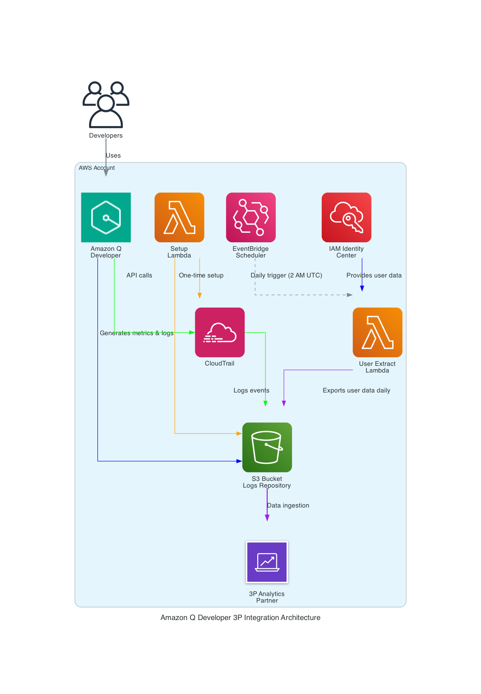

# Amazon Q Developer Metrics - 3P Integration

This repository provides tools for integrating Amazon Q Developer with third-party analytics platforms by automating the setup of data collection and export infrastructure.

## Architecture Overview



The solution creates a complete data pipeline:
- **Amazon Q Developer** generates usage metrics and prompt logs
- **CloudTrail** captures API events for comprehensive auditing
- **S3 Bucket** serves as the centralized data repository
- **Lambda Functions** handle automated setup and daily user data extraction
- **IAM Identity Center** provides user management and data export
- **EventBridge** schedules automated daily processes
- **3P Analytics Partner** ingests data from S3 for analysis

## Prerequisites

- AWS CLI configured with appropriate permissions
- Python 3.11+
- AWS account with access to:
  - Amazon Q Developer Pro subscription
  - CloudTrail
  - IAM Identity Center
  - S3, Lambda, EventBridge (for automation)

## Quick Start

Choose your preferred setup approach:

| Approach | Best For | Execution |
|----------|----------|-----------|
| **Python Script** | One-time setup, immediate feedback, local control | Local machine |
| **Lambda Function** | Automated/scheduled setup, production environments | Serverless |

---

## Approach 1: Python Script (Recommended for Getting Started)

### Setup

1. **Environment Setup**
   ```bash
   # Clone and navigate to the repository
   cd sample-amazon-q-logging-stats
   
   # Create and activate virtual environment
   python -m venv venv
   source venv/bin/activate  # On Windows: venv\Scripts\activate
   
   # Install dependencies
   pip install -r requirements.txt
   ```

2. **Run Setup Script**
   ```bash
   # Basic setup
   python src/setup_q_developer_3p_metrcis.py --bucket-name your-unique-bucket-name
   
   # With user export and custom region
   python src/setup_q_developer_3p_metrcis.py \
     --bucket-name q-developer-metrics-company \
     --region us-west-2 \
     --export-users \
     --output-file identity_center_users.csv
   ```

---

## Approach 2: Lambda Function (For Production/Automation)

### Setup

1. **Navigate to source directory**
   ```bash
   cd src
   ```

2. **Create IAM Role**
   ```bash
   # Create trust policy
   cat > trust-policy.json << 'EOF'
   {
     "Version": "2012-10-17",
     "Statement": [{
       "Effect": "Allow",
       "Principal": {"Service": "lambda.amazonaws.com"},
       "Action": "sts:AssumeRole"
     }]
   }
   EOF
   
   # Create role and attach permissions
   aws iam create-role \
     --role-name lambda-q-developer-role \
     --assume-role-policy-document file://trust-policy.json
   
   aws iam put-role-policy \
     --role-name lambda-q-developer-role \
     --policy-name QDeveloper3PPermissions \
     --policy-document file://lambda_role_policy.json
   ```

3. **Deploy Lambda Function**
   ```bash
   # Package and deploy
   zip -r q_developer_3p_metrics_setup_lambda.zip q_developer_3p_metrics_setup_lambda.py
   
   aws lambda create-function \
     --function-name QDeveloper3PSetup \
     --runtime python3.11 \
     --handler q_developer_3p_metrics_setup_lambda.lambda_handler \
     --role $(aws iam get-role --role-name lambda-q-developer-role --query 'Role.Arn' --output text) \
     --zip-file fileb://q_developer_3p_metrics_setup_lambda.zip \
     --timeout 300 \
     --memory-size 256
   ```

4. **Invoke Lambda Function**
   ```bash
   # Create event configuration
   cat > event.json << 'EOF'
   {
     "bucket_name": "your-unique-bucket-name",
     "region": "us-east-1",
     "export_users": true,
     "output_file": "users.csv"
   }
   EOF
   
   # Invoke function
   aws lambda invoke \
     --function-name QDeveloper3PSetup \
     --cli-binary-format raw-in-base64-out \
     --payload file://event.json \
     response.json
   
   # Check results
   cat response.json
   ```

### Optional: Schedule Daily Execution

```bash
# Create daily schedule (1 AM UTC)
aws events put-rule \
  --name QDeveloper3PSetupSchedule \
  --schedule-expression "cron(0 1 * * ? *)" \
  --state ENABLED

# Grant EventBridge permission to invoke Lambda
aws lambda add-permission \
  --function-name QDeveloper3PSetup \
  --statement-id EventBridgeInvoke \
  --action lambda:InvokeFunction \
  --principal events.amazonaws.com \
  --source-arn $(aws events describe-rule --name QDeveloper3PSetupSchedule --query 'Arn' --output text)

# Create target with configuration
aws events put-targets \
  --rule QDeveloper3PSetupSchedule \
  --targets '[{
    "Id": "1",
    "Arn": "'"$(aws lambda get-function --function-name QDeveloper3PSetup --query 'Configuration.FunctionArn' --output text)"'",
    "Input": "{\"bucket_name\":\"your-bucket-name\",\"region\":\"us-east-1\",\"export_users\":true,\"output_file\":\"users.csv\"}"
  }]'
```

---

## Manual Configuration (Required for Both Approaches)

After running either setup approach, complete these steps in the Amazon Q Developer console:

1. **Subscribe to Amazon Q Developer Pro** (if not already done)

2. **Configure Data Collection**:
   - Go to Amazon Q Developer console
   - **Edit Preferences → Enable prompt logging**
     - Set S3 location: `s3://your-bucket-name/q-developer/prompt-logs/`
   - **Edit Amazon Q Developer usage activity**
     - Enable 'Collect granular metrics per user'
     - Set S3 location: `s3://your-bucket-name/q-developer/`

---

## Optional: Daily User Extraction Lambda

For regular user data updates, deploy a separate Lambda function:

```bash
# Create dedicated role
aws iam create-role \
  --role-name lambda-iam-identity-center-extract-role \
  --assume-role-policy-document file://trust-policy.json

aws iam put-role-policy \
  --role-name lambda-iam-identity-center-extract-role \
  --policy-name IAMIdentityCenterExtractPermissions \
  --policy-document file://iam_identity_center_policy.json

# Deploy function
zip -r iam_identity_center_user_extract_lambda.zip iam_identity_center_user_extract_lambda.py

aws lambda create-function \
  --function-name IAMIdentityCenterUserExtract \
  --runtime python3.11 \
  --handler iam_identity_center_user_extract_lambda.lambda_handler \
  --role $(aws iam get-role --role-name lambda-iam-identity-center-extract-role --query 'Role.Arn' --output text) \
  --zip-file fileb://iam_identity_center_user_extract_lambda.zip \
  --timeout 300 \
  --memory-size 256

# Schedule daily execution (2 AM UTC)
aws events put-rule \
  --name IAMIdentityCenterUserExtractSchedule \
  --schedule-expression "cron(0 2 * * ? *)" \
  --state ENABLED
```

---

## Data Flow

Once configured, the system automatically:

1. **Amazon Q Developer** logs user activity and prompts to S3
2. **CloudTrail** captures Q Developer API events
3. **IAM Identity Center** user data gets extracted (daily if Lambda is scheduled)
4. **3P Analytics Partner** ingests data from S3 for analysis

Data is organized in S3 as:
```
your-bucket-name/
├── q-developer/
│   ├── prompt-logs/
│   └── usage-metrics/
├── cloudtrail-logs/
└── iam-users/
```

---

## Testing & Validation

### Run Test Suite
```bash
# Activate environment and install test dependencies
source venv/bin/activate
pip install pytest

# Run all tests
python -m pytest src/tests/ -v

# Run specific tests
python -m pytest src/tests/test_setup_q_developer_3p_metrics.py -v
```

### Verify Setup
```bash
# Check S3 bucket
aws s3 ls s3://your-bucket-name/

# Verify CloudTrail
aws cloudtrail describe-trails --query 'trailList[?contains(Name, `q-developer-3p-trail`)].Name'

# Test Lambda functions (if deployed)
aws lambda list-functions --query 'Functions[?contains(FunctionName, `QDeveloper`)].FunctionName'
```

---

## Troubleshooting

### Common Issues

**Permission Errors**
```bash
# Verify AWS CLI configuration
aws sts get-caller-identity

# Check IAM permissions
aws iam get-role-policy --role-name lambda-q-developer-role --policy-name QDeveloper3PPermissions
```

**Lambda Function Issues**
```bash
# Check logs
aws logs filter-log-events \
  --log-group-name /aws/lambda/QDeveloper3PSetup \
  --start-time $(date -v-1H +%s000) \
  --query 'events[*].message' \
  --output text
```

**S3 Access Issues**
```bash
# Test bucket access
aws s3 ls s3://your-bucket-name/ || echo "Bucket access failed"
```

### Update Lambda Functions
```bash
# Update main setup Lambda
zip -r q_developer_3p_metrics_setup_lambda.zip q_developer_3p_metrics_setup_lambda.py
aws lambda update-function-code \
  --function-name QDeveloper3PSetup \
  --zip-file fileb://q_developer_3p_metrics_setup_lambda.zip
```

---

## Cleanup

### Automated Cleanup (Recommended)
```bash
# Activate environment
source venv/bin/activate

# Run cleanup script
python src/cleanup_q_developer_3p_metrics.py --bucket-name your-bucket-name --confirm
```

### Manual Cleanup
```bash
# Delete Lambda functions
aws lambda delete-function --function-name QDeveloper3PSetup
aws lambda delete-function --function-name IAMIdentityCenterUserExtract

# Delete IAM roles
aws iam delete-role-policy --role-name lambda-q-developer-role --policy-name QDeveloper3PPermissions
aws iam delete-role --role-name lambda-q-developer-role

# Delete EventBridge rules
aws events remove-targets --rule QDeveloper3PSetupSchedule --ids 1
aws events delete-rule --name QDeveloper3PSetupSchedule

# Delete CloudTrail and S3 bucket
aws cloudtrail delete-trail --name q-developer-3p-trail-your-bucket-name
aws s3 rm s3://your-bucket-name --recursive
aws s3 rb s3://your-bucket-name
```

**Important**: Manually disable Amazon Q Developer data collection in the console after cleanup.
---

## File Structure

```
├── README.md
├── requirements.txt
└── src/
    ├── setup_q_developer_3p_metrcis.py          # Python script approach
    ├── q_developer_3p_metrics_setup_lambda.py   # Lambda function approach
    ├── iam_identity_center_user_extract_lambda.py # Daily user extraction
    ├── cleanup_q_developer_3p_metrics.py        # Cleanup automation
    ├── trust-policy.json                        # IAM trust policy
    ├── lambda_role_policy.json                  # Lambda permissions
    ├── iam_identity_center_policy.json          # User extraction permissions
    ├── event.json                               # Lambda event template
    ├── iam_identity_center_event.json           # User extraction event template
    └── tests/                                   # Test suite
        ├── test_setup_q_developer_3p_metrics.py
        ├── test_iam_identity_center_user_extract_lambda.py
        └── test_cleanup_q_developer_3p_metrics.py
```

---

## Support

For issues or questions:
1. Check the troubleshooting section above
2. Review AWS CloudWatch logs for Lambda functions
3. Verify IAM permissions and AWS service quotas
4. Run the test suite to identify configuration issues
